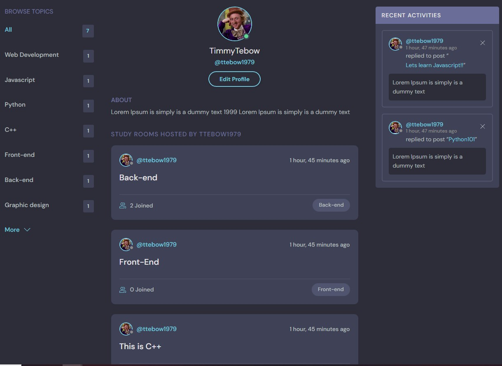

# StudyWithMe
## Introduction
StudyWithMe is a website built in Django using Python, CSS, HTML and Javascript. It enables users to create posts with other users from around the world. It is targetted towards users who enjoy having a discussions about different topics and would like to share their ideas with others. Users have the ability to create categories, create posts, delete posts, edit posts, and create their own profile. They can upload images for use on their profiles.

This is the fifth project for the Code Institute Diploma in Software Development.

The site provides role based permissions for users to interact with a central dataset. It includes user authentication, and Full CRUD functionality for Posts, Comments, Categories, and User Profiles.

 </img>

## Table of Contents
## Table of Contents
* [User Experience Design (UX)](#UX)
    * [The Strategy Plane](#The-Strategy-Plane)
        * [Site Goals](#Site-Goals)
        * [User Story](#User-Story)
    * [The Scope Plane](#The-Scope-Plane)
    * [The Skeleton Plane](#The-Skeleton-Plane)
        * [Wireframes](#Wireframe-mockups)
* [Features](#features)
* [Technologies Used](#technologies-used)
* [Testing](#testing)
* [Deployment](#deployment)
* [Credits](#credits)

## UX
### The Strategy Plane
*  StudyWithMe is intended to be a friendly community site for users to create and share their thoughts and discussions with others. Users will also be able to find rooms created by other users from around the world. 
##### The Sites Ideal User
* Anyone looking to share their thoughts on different subjects with others
* Someone looking to expand their knowledge
* Someone looking for inspiration for new things to try
* Someone looking build their social media following

#### Site Goals

* To provide users with a place to find new discussions
* To provide users with a place to share their own discussions

#### User Story

#### Site Goals
* To provide users with a simple layout.
* To ensure the site is fully accessible on desktop and touch enabled devices
* To ensure the site is fully compliant with keyboard commands and screen readers

### The Scope Plane

**Features planned:**

* User Profile - Create, Read, Update and Delete
* Posts - Users can create, read, update and delete their own Posts
* Other Users Posts - Users can read, Comment and Join rooms.
* Profiles - Users can read other users profiles
* Users can login to their account, change their password or their names.
* Users can reset their password if they forget it
* Users can logout of their account
* Users need to be registered and logged in to add a room or topic.
* Responsive Design - the site needs to be fully responsive to cover the wide variety of devices users may use to access the site
#### The Skeleton Plane
I used Adobe Photoshop to produce wireframes of how the site would look across different devices.

# Features
* Common Features
The site is designed with a central layout that the HTML inserts the relevant CSS into.

* Future Features
There will be an form added where you can order food that has different delivery options.

#### Main Page
 </img>

#### Profile Page
 </img>

#### Rooms Page

 </img>

#### Topics Page

 </img>

#### Settings Page

 </img>

#### Mobile Page
 </img>

#### Validator Testing
* HTML
  * Document checking completed. No errors or warnings to show.

* Lighthouse 
  * The lighthouse report gave a great score of 94
  
  

* Python

  Have not had time to test anything.
#### Notable Bugs
Edit profile has a bug when updating it that i have not have time to fix yet.

## Credits

1. codeinsitute.com
2. stackoverflow.com
3. w3schools.com
4. djangoproject.com
5. slack.com
### Wireframe
* MockFlow - https://www.mockflow.com

#### Technologies Used

* Python
    * The following python modules were used on this project:
        * asgiref==3.6.0
        * backports.zoneinfo==0.2.1
        * cloudinary==1.31.0
        * dj-database-url==0.5.0
        * dj3-cloudinary-storage==0.0.6
        * Django==3.2
        * django-cors-headers==3.13.0
        * djangorestframework==3.14.0
        * gunicorn==20.1.0
        * Pillow==9.4.0
        * psycopg2==2.9.5
        * pytz==2022.7.1
        * sqlparse==0.4.3

#### Resources Used

* The Django documentation was used extensively during development of this project
* The CLOUDINARY documentation was used extensively during development to setup the configuration between django and the CLOUDINARY apis
* The Code Institute reference material was used as a general reference for things that I had previously done during the course.
* All other resources used are referenced where appropriate.

### Deployment

The site was deployed via Heroku, and the live link can be found here - [StudyWithME](https://studywithme.herokuapp.com/)

### Project Deployment

To deploy the project through Heroku I followed these steps:
* Sign up / Log in to [Heroku](https://www.heroku.com/)
* From the main Heroku Dashboard page select 'New' and then 'Create New App'
* Give the project a name - I entered Studywithme and select a suitable region, then select create app. The name for the app must be unique.
* This will create the app within Heroku and bring you to the deploy tab. From the submenu at the top, navigate to the resources tab.
* Add the database to the app, in the add-ons section search for 'Heroku Postgres', select the package that appears and add 'Heroku Postgres' as the database
* Navigate to the setting tab, within the config vars section copy the DATABASE_URL to the clipboard for use in the Django configuration.
* Within the django app repository create a new file called env.py - within this file import the os library and set the environment variable for the DATABASE_URL pasting in the address copied from Heroku. The line should appear as os.environ["DATABASE_URL"]= "Paste the link in here"
* Add a secret key to the app using os.environ["SECRET_KEY"] = "your secret key goes here"
* Add the secret key just created to the Heroku Config Vars as SECRET_KEY for the KEY value and the secret key value you created as the VALUE
* In the settings.py file within the django app, import Path from pathlib, import os and import dj_database_url
* insert the line if os.path.isfile("env.py"): import env
* remove the insecure secret key that django has in the settings file by default and replace it with SECRET_KEY = os.environ.get('SECRET_KEY')
* replace the databases section with DATABASES = { 'default': dj_database_url.parse(os.environ.get("DATABASE_URL"))} ensure the correct indentation for python is used.
* In the terminal migrate the models over to the new database connection
* Navigate in a browser to cloudinary, log in, or create an account and log in. 
* From the dashboard - copy the CLOUDINARY_URL to the clipboard
* in the env.py file created earlier - add os.environ["CLOUDINARY_URL"] = "paste in the Url copied to the clipboard here"
* In Heroku, add the CLOUDINARY_URL and value copied to the clipboard to the config vars
* Also add the KEY - DISABLE_COLLECTSTATIC with the Value - 1 to the config vars
* this key value pair must be removed prior to final deployment
* in the Settings.py file - add the STATIC files settings - the url, storage path, directory path, root path, media url and default file storage path.
* Link the file to the templates directory in Heroku TEMPLATES_DIR = os.path.join(BASE_DIR, 'templates')
* Change the templates directory to TEMPLATES_DIR - 'DIRS': [TEMPLATES_DIR]
* Add Heroku to the ALLOWED_HOSTS list the format will be the app name given in Heroku when creating the app followed by .herokuapp.com
* In your code editor, create three new top level folders, media, static, templates
* Create a new file on the top level directory - Procfile
* Within the Procfile add the code - web: guincorn PROJECT_NAME.wsgi
* In the terminal, add the changed files, commit and push to GitHub
* In Heroku, navigate to the deployment tab and deploy the branch manually - watch the build logs for any errors.
* Heroku will now build the app for you. Once it has completed the build process you will see a 'Your App Was Successfully Deployed' message and a link to the app to visit the live site.

## Github Deployment

* The site was deployed to GitHub pages. The steps to deploy are as follows:
  * In the GitHub repository, navigate to the settings tab
  * Select the pages link from the setting menu on the left hand side 
  * Under the GitHub Pages from the source section drop-down menu, select the master branch 
  * One the master branch has been selected, the page will be automatically refreshed with a detailed ribbon display to indicate the successful deployment. 

### Acknowledgements
I'd like to thank the students and community on slack that helped me through Javascript and the incredible learning materials on code institute.
